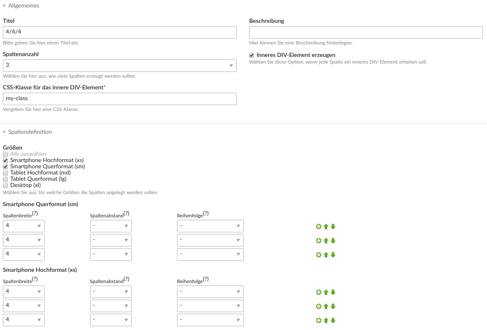

# Contao Subcolumns Bootstrap Bundle

This Contao 4 bundle adds support for the bootstrap 4 grid to [felixpfeiffer/subcolumns](https://github.com/felixpfeiffer/Contao-Subcolumns).

Courtesy to:

- [contao-legacy/subcolumns_bootstrap_customize](https://legacy-packages-via.contao-community-alliance.org/packages/contao-legacy/subcolumns_bootstrap_customize)

## Requirements

- Bootstrap 4.0.0 (Beta 2)

## Features

- Handle column sets in a contao entity -> also customizable by non-developers
- clear layout for editors (see above)
- Support for columns breaking out of the container (add a css class or click the corresponding option in your column start element)
    - `col-full`: Column taking the full width of the viewport while being inside a container
    - `col-full-left`: Column taking the full width *on the left* of the viewport while being inside a container
    - `col-full-right`: Column taking the full width *on the right* of the viewport while being inside a container
- add div wrappers with arbitrary css classes
- wrap column sets with a "container"-div

## Technical instructions

1. Specify "Bootstrap 4" in the subcolumns configuration
2. Navigate to the subcolumns section on the left and create a column set.
3. Navigate to the desired article and add a new Column set start element (the other elements are created automatically).
4. Choose the column set you created in step 2.

## Known issues

- sorting via sort anchor (ajax) isn't working -> use synchronous cut action instead (the blue arrow)